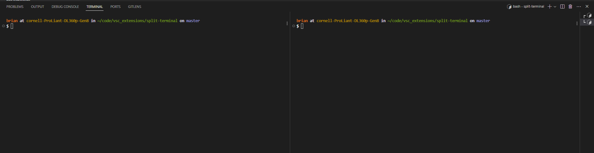

# split-terminal README

This is a simple VSC extension to automatically split your terminal to two window panes.

It can also execute a command that can defined inside your settings.json once the terminal has opened.

In your settings.json. it should include "split-terminal.myStartCommand" with the value that you would like you terminal to execute.

## Features

When opening VSC, your terminal panes should look like this:

## Release Notes

### 1.0.0

Initial release
